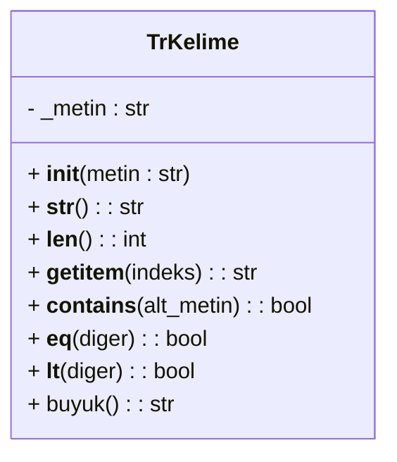

```mermaid
classDiagram
    class TrKelime {
        - _metin : str
        + __init__(metin : str)
        + __str__() : str
        + __len__() : int
        + __getitem__(indeks) : str
        + __contains__(alt_metin) : bool
        + __eq__(diger) : bool
        + __lt__(diger) : bool
        + buyuk() : str
    }
```